# War battles tutorial

This tutorial goes through the steps needed to create a small playable game embryo in Defold using C#.  This tutorial is based of the Defold-included War Battles tutorial, and assumes at least a passing familiarity with C# and Defold.  If you have neither, following the lua War Battles tutorial instead is recommended.

You start with an empty project but we have added the required assets for you, as well as added the necessary components from [DefoldSharp](https://github.com/RealityStop/DefoldSharp) to begin working in C#. You can verify that the project is empty by opening the solution file in the `src` folder and compiling it using the IDE of your choice.  Once the compilation is complete, you can launch the project by opening it in Defold and [building and running it](defold://build) (or selecting <kbd>Project ▸ Build</kbd> from the menu). This will launch the game and you should see nothing but a black window.  That's because we haven't added anything to it yet!

## Draw the game map

Your game needs a setting, a map. The map that you are going to draw will be made out of tiles, small images that are put together like a mosaic into a larger image. In Defold, such an image is called a *Tile map*. In order to create a tile map, you need an image file that contains the various tiles. You then need to specify the size of the tiles, margins and padding and what image file to use in a file of a type called *Tile source*.

1. <kbd>Right click</kbd> the folder "main" and select <kbd>New ▸ Tile source</kbd>. This will create a new tile source file. Name the file "map" (full name "map.tilesource").

   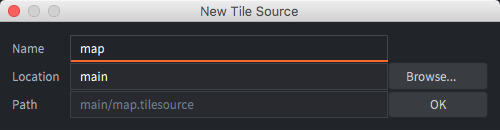

2. The new tilesource file opens automatically in the editor. Set the *Image* property of the tile source to the image file "/assets/map.png". The easiest way to do that is to click the resource selector by the *Image* property to bring up the resource selector. Then select the file "/assets/map.png":

    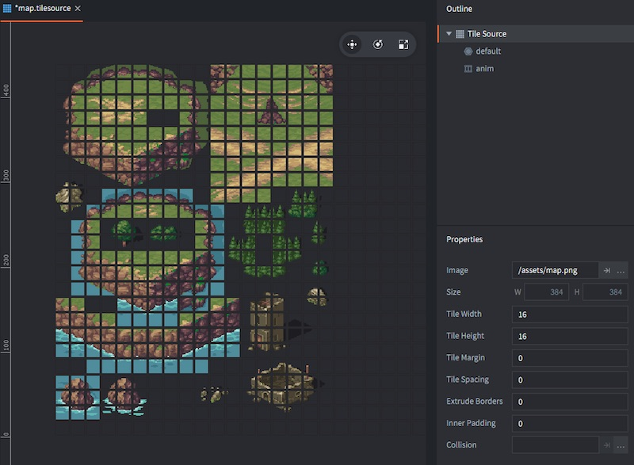

    The tiles are 16⨉16 pixels in the source image with no margins or padding so there is no need to alter the default properties of the tile source.

3. <kbd>Right click</kbd> the folder "main" and select <kbd>New ▸ Tile map</kbd>. Name the file "map" (full name "map.tilemap"). The tile map is automatically opened in the editor view.

4. Set the *Tile source* property of the new tile map to "/main/map.tilesource".

5. Select "layer1" in the *Outline*.

6. Select <kbd>Edit ▸ Select Tile...</kbd>. This brings up the tile palette.

    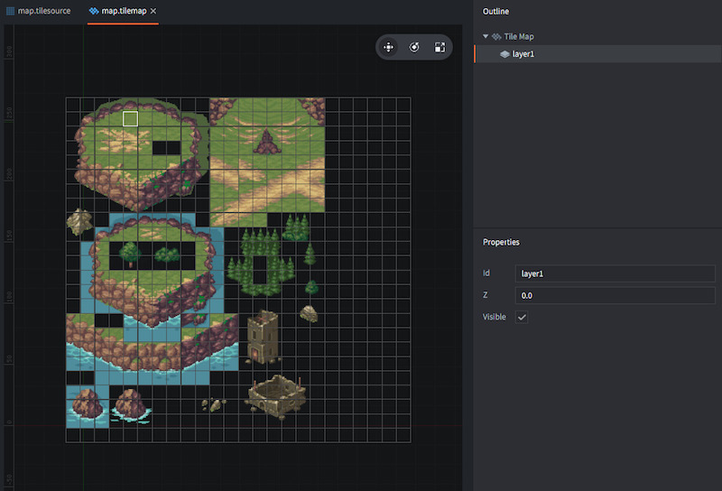

7. Click on a grass tile. This selects the clicked tile as the current brush. Then paint the tile map layer as you see fit with the grass tile. Select other tiles from the tile palette to paint different graphics.

8. You can hold <kbd>Shift</kbd>, then <kbd>click and drag</kbd> to make a selection on the current tile map layer. The selection then becomes your new brush. This is a useful way to paint with a brush consisting of multiple tiles.

    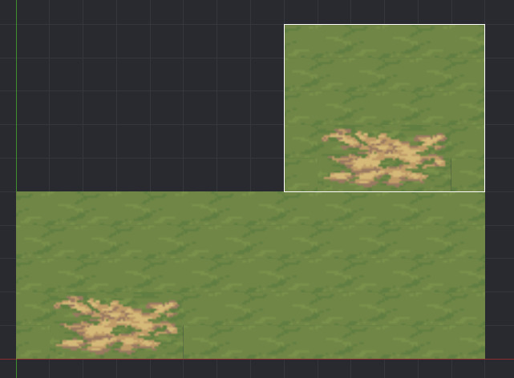

When you are happy with the map, it is time to add it to the game.

## Add the map to the game

Defold stores everything you build in *collections*. A collection is a file used to build hierarchies of game objects and other collections. In the file "game.project" you specify a particular collection that is loaded when the game starts up. This is initially set to the file "/main/main.collection".

1. Open the file ["main.collection"](defold://open?path=/main/main.collection).

2. <kbd>Right click</kbd> the root node of the collection in the *Outline* and select <kbd>Add game object</kbd>.

    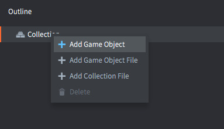

3. Change the *Id* property of the game object to "map". The id does not really matter for this game object but it is a good habit to set identifiers that are descriptive---it makes it easier to find your way around when you have many game objects.

4. <kbd>Right click</kbd> the new game object and select <kbd>Add Component File</kbd>.

    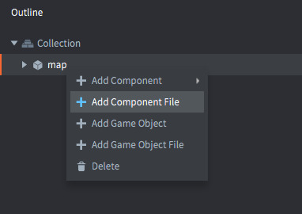

5. In the resource selector, pick the file "/main/map.tilemap". This creates a new component in the game object based on the tilemap file. The tile map should now appear in the editor view.

    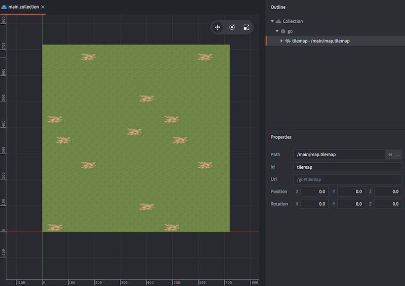

6. Run the game by selecting <kbd>Project ▸ Build</kbd> and check that everything looks good. If you feel that the window is a bit large you can open "game.project" in the project root and alter the display width and height:

    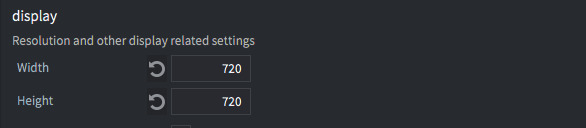
    
NOTE: If you get an "Out of tiles to render" error when running the game it means that the tilemap you created was larger than the maximum configured number of tiles. You can solve this by increasing the [Tilemap->Max Tile Count](https://defold.com/manuals/project-settings/#max-tile-count) value in the *game.project* file.

## Create the player animation

1. <kbd>Right click</kbd> the folder "main" in the *Assets* view and select <kbd>New ▸ Atlas</kbd>. Name the new atlas file "sprites" (full name "sprites.atlas"). An atlas is a collection of images (PNG or JPEG) that are baked into a larger texture. Defold uses atlases instead of single image files for performance and memory reasons. The new atlas should open in the editor.

2. <kbd>Right click</kbd> the root node of the atlas in the *Outline* and select <kbd>Add Animation Group</kbd>.

3. Select the new animation group and change its *Id* property to "player-down".

4. <kbd>Right click</kbd> the "player-down" animation group and select <kbd>Add Images...</kbd>. In the resource selector, pick the images "/assets/infantry/down/1.png" to "/assets/infantry/down/4.png". You can type "down" in the text box to filter the selection of images.

    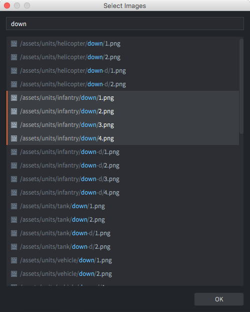

5. With the animation group marked, select <kbd>View ▸ Play</kbd> from the menu to preview the animation. Press <kbd>F</kbd> to frame the animation in the editor if necessary. The animation will play back at full 60 FPS which is way too fast. Set the playback speed (*Fps* property) to 8.

    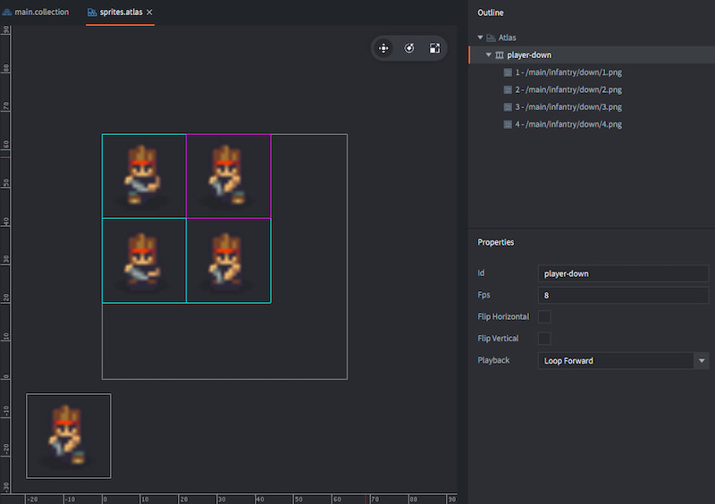

Now you have an atlas with a single flipbook animation for the player. This is enough for initial testing---you can add more animations later. Now, let's create the player game object.

## Create the player game object

A Defold game object is an object with an id, a position, a rotation and a scale that holds components. They are used to create things like a player character, a bullet, a game's rule system or a level loader/unloader. A component, in turn, is an entity that gives a game object visual, audible and/or logic representation in the game.

1. Open "main.collection".

2. <kbd>Right click</kbd> the root node of the collection in the *Outline* and select <kbd>Add Game Object</kbd>. Set the *Id* property of the new game object to "player".

3. Change the Z *Position* property of the game object named "player" to 1.0. Since the "map" game object is at the default Z position 0 the "player" game object must be at a higher value (between -1.0 and 1.0) for it to be on top of the level.

4. <kbd>Right click</kbd> the game object "player" and select <kbd>Add Component ▸ Sprite</kbd>. This creates a new sprite component, that can show graphics, in the "player" game object.

5. Make sure that the Z *Position* of the *Sprite* is 0 so it will be rendered at the same depth as the game object "player". Setting the Z to a different value will offset the sprite depth from 1.0, which is the Z position of the game object.

6. Set the *Image* property of the sprite to "/main/sprites.atlas".

7. Set the *Default Animation* property of the sprite to "player-down".

    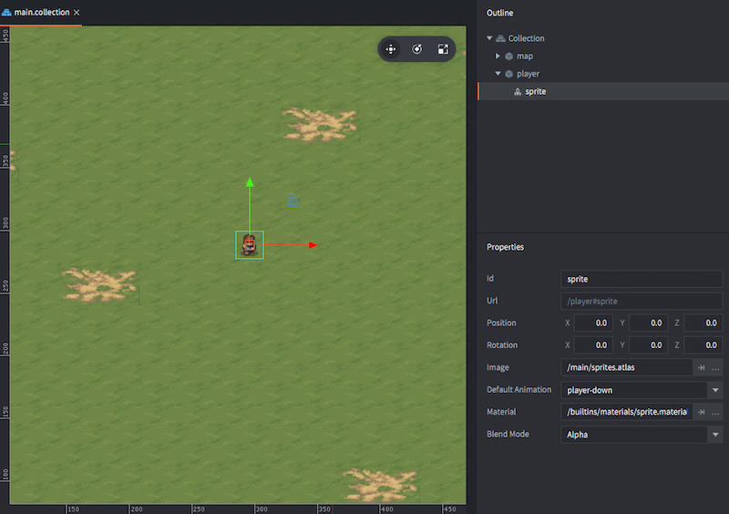

8. Run the game and check that the player character is animating.

The player game object now has visual representation in the game world. The next step is to add a script component to the player game object. This will allow you to create player behavior, such as movement. But that depends on user input, so first you need to set that up.

## Add input bindings

There are no inputs mapped by default, so you need to add input actions for your player character:

1. Open the file "/input/game.input_binding". This file contains mappings from input sources (keyboard, touch screen, game pads etc) to input *actions*. Actions are just names that we want to associate with certain input.

2. Add *Key triggers* for the four arrow keys. Name the actions "up", "down", "left" and "right".

    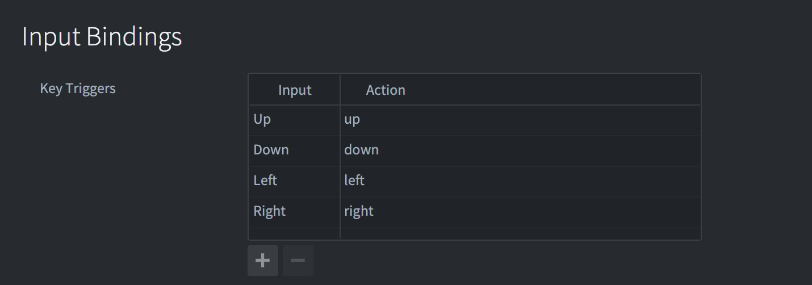

## Create the player script

Unlike the sprite component, which you added directly into the "player" game object, a script component requires that you create a separate file. This script file is then used a template for the script component.

1. Add a new C# class for the player in the root folder of the project and name it Player.  Modify the class so it derives from `GameObjectScript`.  Save and Compile the C# project to update the Defold lua.
 > Note that it may take a few seconds after returning to Defold for Defold to notice the file system changes.

```C#
	using support;

	public class Player : GameObjectScript
	{

	}
```

2. Open "main.collection", <kbd>Right click</kbd> the game object "player" and select <kbd>Add Component File</kbd>. Pick the new file `/scripts/Player.script` as the file to use for the component.  This file was autogenerated by DefoldSharp, and references the code that we will add to our Player class.

You now have a script that runs in the "player" game object. It does not do anything yet though. We'll start by creating the logic for player movement.

## Program the player movement

Move back to C# and add the following to the Player class:

 ```C#
protected override void init()  
{  
	RequestInput();  
}
```

Doing this tells Defold to forward input events (such as mouse clicks) to this object.  These will be sent to the `on_input` method, so let's override that next.

 ```C#
protected override bool on_input(Hash action_id, object action)  
{  
	return false;  //Returning false allows other listeners to also get the input event.
}
```

If we add a `using types;`, we add access to the DefoldSharp OOP API, allowing us to create a `Vector2` and record the user input:
 ```C#
private Vector2 _input = new Vector2();  
protected override bool on_input(Hash action_id, object action)  
{  
	if (action_id == Defold.hash("up"))  
		_input.y = 1;  
	else if (action_id == Defold.hash("down"))  
		_input.y = -1;  
	else if (action_id == Defold.hash("left"))  
		_input.x = -1;  
	else if (action_id == Defold.hash("right"))  
		_input.x = 1;  
	
	return false;  
}
```

However, this is a bit inefficient, as many input events can happen even within a single frame, and we're hashing for every event.  Instead, let's introduce a static class to store common input hashes.

Create a new static class `CommonInput` and give it some static properties:
```C#
using types;  
  
public static class CommonInput  
{  
	public static Hash Up { get; } = Defold.hash("up");  
	public static Hash Down { get; } = Defold.hash("down");  
	public static Hash Left { get; } = Defold.hash("left");  
	public static Hash Right { get; } = Defold.hash("right");  
	public static Hash Fire { get; } = Defold.hash("fire"); 
	
	public static Hash LeftClick { get; } = Defold.hash("left_click");  
	
	public static Hash RightClick { get; } = Defold.hash("right_click");  
}
```

Then we can use these cached Hashes in our Player script.  We'll also take this opportunity to record the movement we want from the input as a vector with length 1 (so diagonal movement isn't faster than cardinal direction movement):

```C#
private Vector2 _movementDirection = new Vector2(0,-1,0);  
private bool _moving;  
private Vector2 _input = new Vector2();  
protected override bool on_input(Hash action_id, object action)  
{  
	if (action_id == CommonInput.Up)  
		_input.y = 1;  
	else if (action_id == CommonInput.Down)  
		_input.y = -1;  
	else if (action_id == CommonInput.Left)  
		_input.x = -1;  
	else if (action_id == CommonInput.Right)  
		_input.x = 1;  
	
	_moving = _input.Magnitude() > 0;  
	if (_moving)  
		_movementDirection = _input.Normalize();  //This will transfrom our input into a diagonal-safe version.  We'll use _movementDirection for any movement.
	return false;  
}
```

Next, we need to give our player movement, so let's overrride `update` and give it some linear movement characteristics based on the new _movementDirection vector we created:

```C#
private float _speed = 50;  
protected override void update(float dt)  
{  
	if (_moving)  
		go.set_position(go.get_position() + _movementDirection * _speed * dt);  
	
	_input.x = 0;  
	_input.y = 0;  
	_moving = false;  
}

```

Compile the C# and let Defold update.  Then [build and run](defold://build) to verify that the player moves as expected.  For reference, the full script is below:

```C#
using support;
using types;

public class Player : GameObjectScript
{
	private readonly Vector2 _input = new Vector2();
	private Vector2 _movementDirection = new Vector2(0, -1, 0);
	private bool _moving;
	private readonly float _speed = 50;


	protected override void init()
	{
		RequestInput();
	}


	protected override bool on_input(Hash action_id, object action)
	{
		if (action_id == CommonInput.Up)
			_input.y = 1;
		else if (action_id == CommonInput.Down)
			_input.y = -1;
		else if (action_id == CommonInput.Left)
			_input.x = -1;
		else if (action_id == CommonInput.Right)
			_input.x = 1;


		_moving = _input.Magnitude() > 0;
		if (_moving)
			_movementDirection = _input.Normalize();

		return false;
	}


	protected override void update(float dt)
	{
		if (_moving)
			go.set_position(go.get_position() + _movementDirection * _speed * dt);

		_input.x = 0;
		_input.y = 0;
		_moving = false;
	}
}
```

With the code above, your game now has a player character that can move around on the screen. Next, let's add the possibility to fire rockets.

## Create a rocket game object

Rockets should work like this: whenever the user presses a key, a rocket should fire. It should be possible to fire any number of rockets. To solve that you cannot just add a rocket game object to "main.collection"---that would be only one single rocket object. Instead, what you need to is a *blueprint* for a rocket game object and then a *factory* that creates new game objects on the fly based on that blueprint.

Start by creating the game object blueprint file:

1. <kbd>Right click</kbd> the folder "main" in the *Assets* view and select <kbd>New ▸ Game Object</kbd>. Name this file "rocket" (full name "rocket.go").

2. Open "sprites.atlas" and create a new animation group (right click the root node and select <kbd>Add Animation Group</kbd>). Name the animation "rocket".

3. Add the three rocket images (in "/assets/buildings/turret-rocket") to the animation group and set the *Fps* property to a value that makes the animation look good when you preview.

    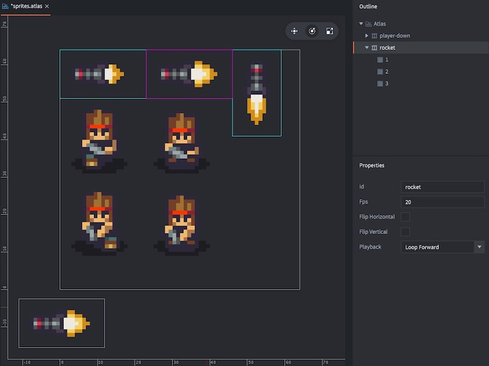

4. Open "rocket.go" and <kbd>Right click</kbd> the root in the *Outline* and select <kbd>Add Component ▸ Sprite</kbd>.

5. Set the *Image* property of the sprite to "/main/sprites.atlas" and the *Default Animation* to "rocket".

Now you have a basic rocket game object blueprint, on file. The next step is to add functionality to spawn game objects based on this blueprint file. For that, you will use a *Factory* component. You also need to add a new input action for the firing mechanic.

## Spawn rockets

1. Open "main.collection" and <kbd>Right click</kbd> on the "player" game object. Select <kbd>Add Component ▸ Factory</kbd>.

2. Select the new factory component and set its *Id* property to "rocketfactory" and its *Prototype* to the file "/main/rocket.go" (the one you created above). Now the player game object is all set.

3. Open the file "/input/game.input_binding".

4. Add a *Key trigger* for the firing action. Call this action "fire".

    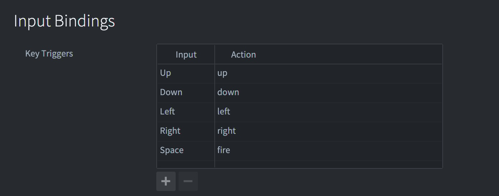

5. Open "main/player.script" and add a boolean to track if the player is firing.
```C#
	private bool firing;
```

6. Then, thinking of how we want to happen when the user fires.  We need to tell Defold to create a new game object instance of the type Rocket.  Let's handle that in our Player update.  Factories handle instantiating for us, so all we have to do is ask it to go ahead and create.

    ```C#
    protected override void update(float dt)  
	{  
		if (_moving)  
			go.set_position(go.get_position() + _movementDirection * _speed * dt);  
		
		if (_firing)  
			factory.create("#rocketfactory");  
		 
		_input.x = 0;  
		_input.y = 0;  
		_moving = false;
		_firing = false;  //Don't forget to turn off firing again!
	}
    ```

 7. Now that we have that, let's add the input processing.  We already set up a CommonInput for the "fire" action, so we can just add an extra case to our Player input, with a slight difference.  We only want the player to fire a rocket when they actually press the spacebar, not every frame they hold it down.  Fortunately, Defold provides the information we need in the `action` parameter, which we need to access.  To do that, we need to modify the method spec so that the action parameter is of type `dynamic` rather than object.  That's because during the Alpha for DefoldSharp, we don't have types defined for the various standard tables Defold uses, but we still need the transpiler to accept what we know is there.  `dynamic` tells the C# compiler to accept what we type and the transpiler to directly copy however we access the "action".

```C#
protected override bool on_input(Hash action_id, dynamic action)  
{  
	  if (action_id == CommonInput.Up)  
		  _input.y = 1;  
	  else if (action_id == CommonInput.Down)  
		  _input.y = -1;  
	  else if (action_id == CommonInput.Left)  
		  _input.x = -1;  
	  else if (action_id == CommonInput.Right)  
		  _input.x = 1;  
	  else if (action_id == CommonInput.Fire && action.pressed)  //this will compile because of the dynamic type, and be converted to lua correctly.
		  _firing = true;  
	  
	  _moving = _input.Magnitude() > 0;  
	  if (_moving)  
		  _movementDirection = _input.Normalize();  
	  
	  return false;  
}
```

If you compile and run the game now you should be able to move around and drop rockets all over the map by hammering the fire key. This is a good start.

## Set the direction of the rocket

When a rocket is spawned, it is currently not oriented in the player's direction. That needs to be fixed. It should also fly straight ahead and explode after a short interval.  To do this, we're going to start by creating a new Rocket class and giving it some simple logic.  Since we want this class to be a game object script in Defold, we'll derive from `GameObjectScript`.

```C#
using support;
using types;

public class Rocket : GameObjectScript
{
	private float _speed = 200;
	private Vector2 _movementDirection = new Vector(0,1,0);

	protected override void update(float dt)
	{
		go.set_position(go.get_position() + _movementDirection * _speed * dt);
	}
}
```

Add it to your Rocket game object and test the program.  The rocket is spawned, but we have a problem.  How do we learn the movement direction from the player?  We could make the player direction a static and create a dependency, or we could make use of Defold [properties](https://defold.com/manuals/properties/), which allow you to expose script values for editing in the editor, manipulation via animations, or defining on object creation.  We'll make use of this latter ability here, by passing the direction to the rocket when our factory creates the rocket.

To do this in DefoldSharp, we have to define a class to hold all Defold component properties our class will expose.  In DefoldSharp, these are referred to `AnimatableProperties`.  So we'll create a derived class just above our Rocket and give it a "Direction property".

```C#
public class RocketProperties : AnimatableProperties  
{  
  public Vector2 Direction;  
}
```

To use this in our Rocket class, we need to derive from the generic version of GameObjectScript by modifying our class specification to the following:
```C#
public class Rocket : GameObjectScript<RocketProperties>
```

Now, our Rocket's RocketProperties are accessible via the Properties member.  So let's rewrite our Rocket to use this "Direction" rather than our private movementDirection.

The entire Rocket script looks like:

```C#
using support;
using types;

public class RocketProperties : AnimatableProperties
{
	public Vector2 Direction;
}

public class Rocket : GameObjectScript<RocketProperties>
{
	private float _speed = 200;

	protected override void update(float dt)
	{
		go.set_position(go.get_position() + Properties.Direction * _speed * dt);
	}
}
```


Finally, we need to modify our Player script to set the direction when the player fires a rocket.  In the Alpha, we have to create a Table manually and pass it to the `factory.create` method.

```C#
	if (_firing)  
	{  
		  var angle = Math.Atan2(_movementDirection.y, _movementDirection.x);  
		  var rotation = vmath.quat_rotation_z(angle);  
		  LuaTable props = new LuaTable();  
		  props.Add("Direction", _movementDirection);  
		  factory.create("#rocketfactory", null, rotation, props);  
	}
```


Run the game and try the new mechanic. Notice that the rockets fly in the right direction but they are oriented 180 degrees wrong. That's an easy fix.

    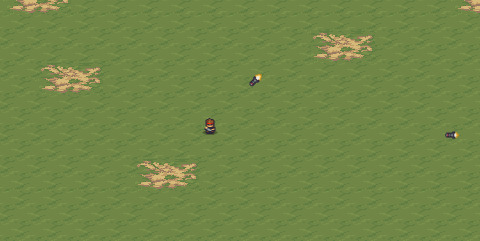

Open "sprites.atlas", select the "rocket" animation and click the *Flip horizontal* property.

    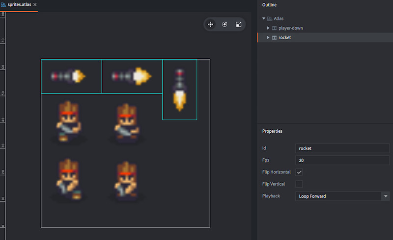

Run the game again to verify that everything looks ok.

    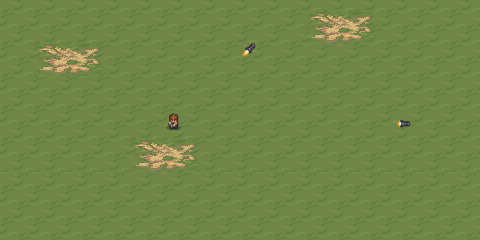

## Make the rockets explode

The rockets should explode a short while after they are fired:

1. Open "sprites.atlas" and create a new animation group (right click the root node and select <kbd>Add Animation Group</kbd>). Call the animation "explosion".

2. Add the nine explosion images in "/assets/fx/explosion" to the animation group and set the *Fps* property to a value that makes the animation look good when you preview. Also make sure that this animation has the *Playback* property set to `Once Forward`.

    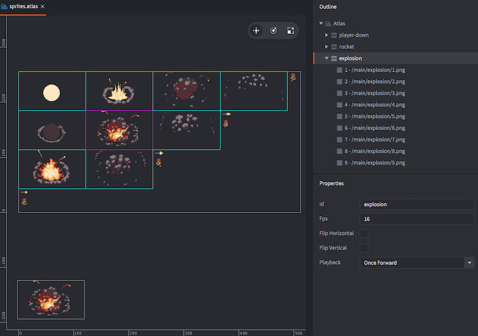

3. Open "rocket.script" add a variable to track the remaining life and whether the rocket has exploded, since we want it play the explosion animation, and we want to disable movement while the animation is playing.  Then we handle decreasing the life timer and starting the animation when there is no life remaining.  When the rocket explodes, we also clear out any rotation so that the animation plays correctly.

    ```C#
	public class Rocket : GameObjectScript<RocketProperties>
	{
		private float _speed = 200;
		private float _life = 1;
		private bool _isExploded;
		

		protected override void update(float dt)
		{
			//If we've already exploded, there's no need for any movement or secondary explosions.
			if (_isExploded)
				return;
			
			//Movement
			go.set_position(go.get_position() + Properties.Direction * _speed * dt);

			//Life update and explosion
			_life -= dt;   //Decrease the life timer with delta time. It will decrease with 1.0 per second.
			if (_life < 0)
			{
				_isExploded = true;
				go.set_rotation(new Quaternion()); //Set the game object rotation to 0, otherwise the explosion graphics will be rotated
				
				LuaTable table = new LuaTable();
				table.Add("id", Defold.hash("explosion"));

				msg.post("#sprite", "play_animation", table);
			}
		}
	}
    ```
	
	If you compile and play the game now, the rockets will fly for a second and explode!  However, the last frame of the animation will linger around.  We could fix that by starting another timer, but it is better to listen for the animation to complete.  To do that, we need to override the `on_message` method and listen for the message emitted by the <kbd>sprite</kbd> component when the animation finishes playing.
   

    ```C#
	protected override void on_message(Hash message_id, object message, object sender)
	{
		if (message_id == Defold.hash("animation_done"))
			go.delete();
	}
	```

Run the game.

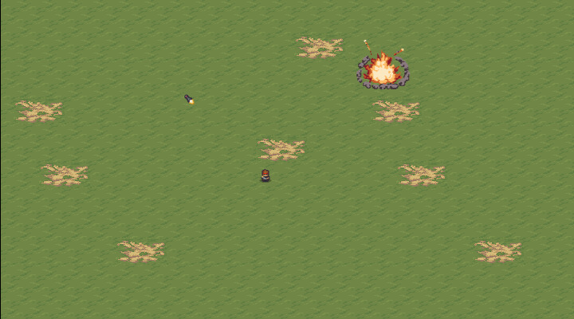

This is definitely getting somewhere! Now you just need something to fire the rockets at!

## Create a tank game object

1. <kbd>Right click</kbd> the folder "main" in the *Assets* view and select <kbd>New ▸ Game Object</kbd>. Name this file "tank" (full name "tank.go"). Like the rocket game object, this is a file that can be used as a *blueprint* when creating actual tank game objects.

2. Open "sprites.atlas" and create a new animation group (right click the root node and select <kbd>Add Animation Group</kbd>). Name the animation "tank-down".

3. Add the two downwards facing images in "/assets/units/tank/down" to the animation and set it's *Fps* value to something that looks good.

    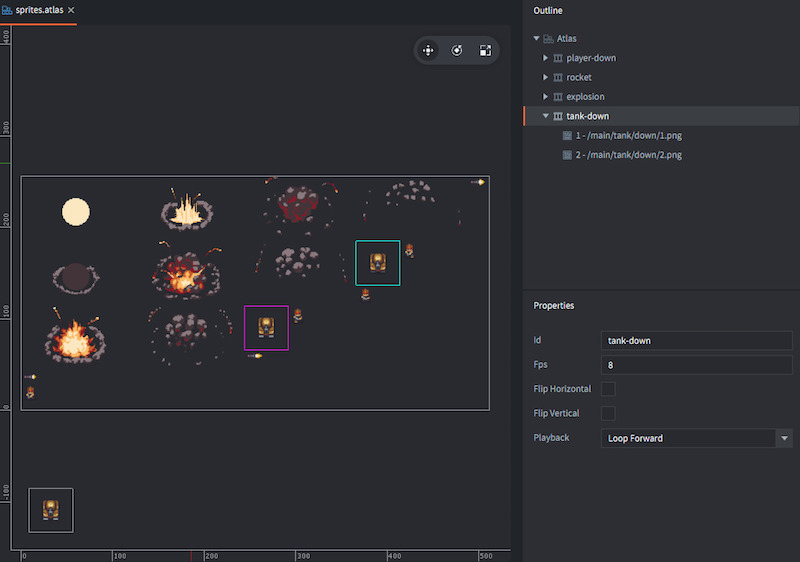

4. Open "tank.go" and <kbd>Right click</kbd> the root in the *Outline* and select <kbd>Add Component ▸ Sprite</kbd>.

5. Set the *Image* property of the sprite to "/main/sprites.atlas" and the *Default animation* to "tank-down".

6. Open "main.collection".

7. <kbd>Right click</kbd> the root node of the collection in the *Outline* and select <kbd>Add Game Object File</kbd>. Select "tank.go" as blueprint for the new game object.

8. Create a few more tanks from the blueprint. Position them on the map with the *Move Tool*. Make sure to set the Z position to 1.0 so they are all rendered on top of the map.

    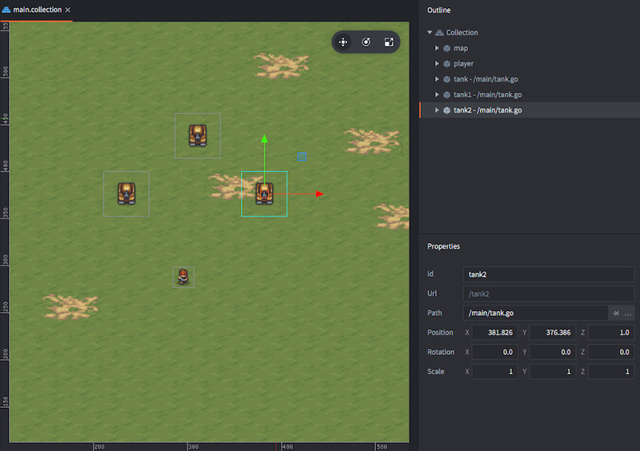

Run the game and check that the tanks look okay.

## Add collision objects

When you fire at the tanks, the rockets currently fly straight through them. The next step is to add collision between the tanks and the rockets:

1. Open "tank.go" and <kbd>Right click</kbd> the root in the *Outline* and select <kbd>Add Component ▸ Collision Object</kbd>.

2. Set the *Type* property to "Kinematic". This means that the physics engine will not simulate any gravity or collision on this object. Instead it will only detect and signal collisions and leave it to you to code the response.

3. Set the *Group* property to "tanks" and *Mask* to "rockets". This causes this game object to detect collisions against object in the group "rockets" that has the mask set to "tanks".

4. <kbd>Right click</kbd> the "collisionobject" component in the *Outline* and select <kbd>Add Shape ▸ Box</kbd>. Set the size of the box shape to match the tank graphics.

    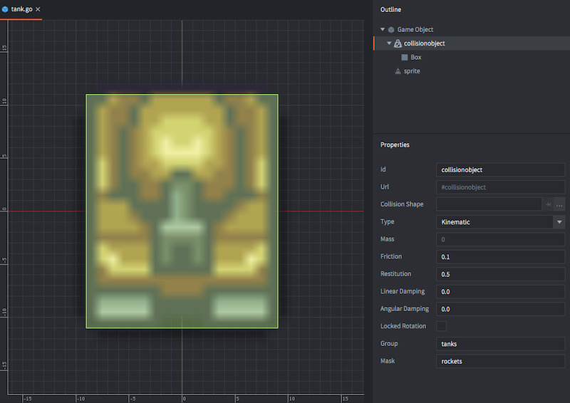

6. Open "rocket.go" and <kbd>Right click</kbd> the root in the *Outline* and select <kbd>Add Component ▸ Collision Object</kbd>.

7. Set the *Type* property to "Kinematic".

8. Set the *Group* property to "rockets" and *Mask* to "tanks". This causes this game object to detect collisions against object in the group "tanks" that has the mask set to "rockets".

    Now the group and mask between rockets and tanks match each other so the physics engine will detect when they interact.

9. Right click the "collisionobject" component in the Outline and select Add Shape ▸ Box. Set the size of the box shape to match the rocket graphics.

    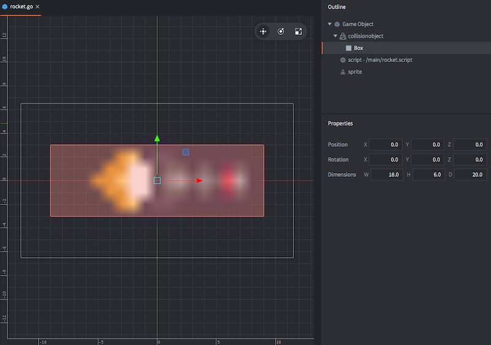

The physics engine sends messages to game objects that collide. The last piece of the puzzle is to add code that reacts to those messages.

## Code a reaction to the collisions

Now we need to make the Rocket react to hits.  For a full game, we'd probably record the damage on the Tank and let the tank decide if the damage is sufficient to destroy it.  For now, we'll just update the Rocket and have it destroy the tank.

Since there are now two causes for a rocket explosion (timer expiration and collision), let's refactor the explosion code into a method we can call.

```C#

	private void Explode()
	{
		_isExploded = true;
		go.set_rotation(
			new Quaternion()); //Set the game object rotation to 0, otherwise the explosion graphics will be rotated

		LuaTable table = new LuaTable();
		table.Add("id", Defold.hash("explosion"));

		msg.post("#sprite", "play_animation", table);
	}
```

and now we can call that instead in the update and as a response to the collision.  Here's the complete script with a few notes on the changes.

    ```C#
	using support;
	using types;

	public class RocketProperties : AnimatableProperties
	{
		public Vector2 Direction = new Vector2();
	}

	public class Rocket : GameObjectScript<RocketProperties>
	{
		private float _speed = 200;
		private float _life = 1;
		private bool _isExploded;
		

		protected override void update(float dt)
		{
			//If we've already exploded, there's no need for any movement or secondary explosions.
			if (_isExploded)
				return;
			
			//Movement
			go.set_position(go.get_position() + Properties.Direction * _speed * dt);

			//Life update and explosion
			_life -= dt;   //Decrease the life timer with delta time. It will decrease with 1.0 per second.
			if (_life < 0)
				Explode();
		}


		private void Explode()
		{
			_isExploded = true;
			go.set_rotation(
				new Quaternion()); //Set the game object rotation to 0, otherwise the explosion graphics will be rotated

			LuaTable table = new LuaTable();
			table.Add("id", Defold.hash("explosion"));

			msg.post("#sprite", "play_animation", table);
		}

		
		protected override void on_message(Hash message_id, dynamic message, object sender)  //<-- Note we had to change to dynamic here, just like we did for the player's on_input
		{
			if (message_id == Defold.hash("animation_done"))
				go.delete();
				
			//The engine sends a message called "collision_response" when the shapes collide, if the group and mask pairing is correct.
			if (message_id == Defold.hash("collision_response"))
			{
				Explode();
				go.delete(message.other_id, true);	//We need to delete the game object the rocket collided with, which we access through the message.other_id variable.
			}
		}
	}
    ```
   

Run the game and destroy some tanks! The tanks aren't very interesting enemies, but they should nevertheless give you some score.

## Create the scoring GUI

1. <kbd>Right click</kbd> the folder "main" in the *Assets* view and select <kbd>New ▸ Font</kbd>. Name this file "text" (full name "text.font").

2. Open "text.font" and set the *Font* property to the file "/assets/fonts/04font.ttf".

    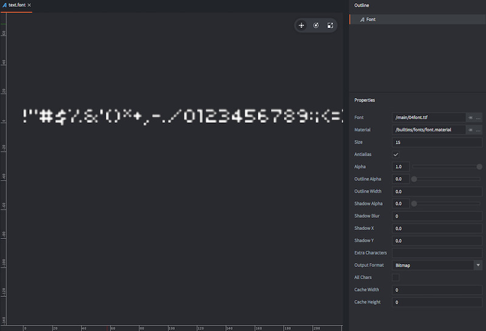

3. <kbd>Right click</kbd> the folder "main" in the *Assets* view and select <kbd>New ▸ Gui</kbd>. Name this file "ui" (full name "ui.gui"). It will contain the user interface where you will place the score counter.

4. Open "ui.gui". <kbd>Right click</kbd> *Fonts* in the *Outline* view and select <kbd>Add ▸ Fonts</kbd>. Select the "/main/text.font" file.

5. <kbd>Right click</kbd> *Nodes* in the *Outline* view and select <kbd>Add ▸ Text</kbd>.

6. Select the new text node in the outline and set its *Id* property to "score", its *Text* property to "SCORE: 0", its *Font* property to the font "text" and its *Pivot* property to "West".

7. Place the text node in the top left corner of the screen.

    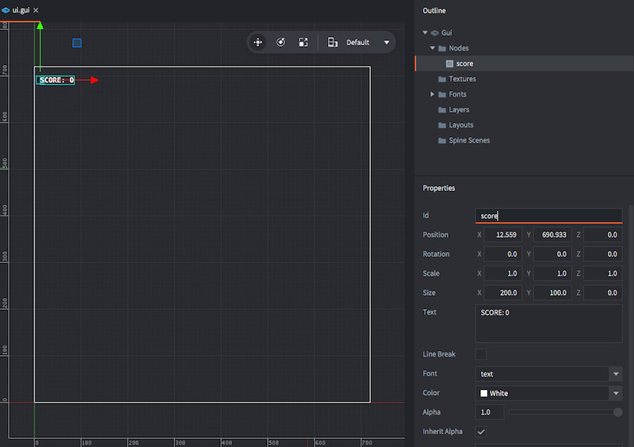

8. <kbd>Right click</kbd> the folder "main" in the *Assets* view and select <kbd>New ▸ Gui Script</kbd>. Name this new file "ui" (full name "ui.gui_script").

9. Go back to "ui.gui" and select the root node in the *Outline*. Set the *Script* property to the file "/main/ui.gui_script" that you just created. Now if we add this Gui as a component to a game object the Gui will be displayed and the script will run.

10. Open "main.collection".

11. <kbd>Right click</kbd> the root node of the collection in the *Outline* and select <kbd>Add Game Object</kbd>.

12. Set the *Id* property of the game object to "gui", then <kbd>Right click</kbd> it and select <kbd>Add Component File</kbd>. Select the file "/main/ui.gui". The new component will automatically get the *Id* "ui".

    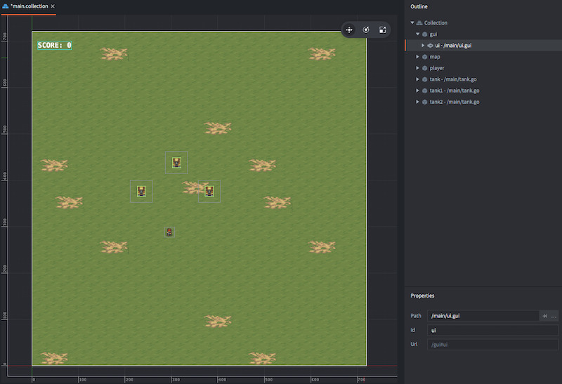

Now the score counter is displayed. You only need to add functionality in the Gui script so the score can be updated.

## Code the scoring update

Create a new script and derive from GUIScript.
```C#
	public class MainUI : GUIScript
	{
		private Node _scoreNode;
		
		protected override void init()
		{
			_scoreNode = gui.get_node("score");
		}
	}
```

We also need to add a new custom message.  Custom messages allow us to work with message data in a type safe way.  First, we'll make the message declaration.
```C#
public class AddScoreMessage : CustomMessageImplementation
{
	public float scoreChange;
}
```

Now, let's go back to our MainUI class and handle this message.  While we could use the `dynamic` trick to again let C# let us type the information, by using a Custom message, we can send and receive the message much safer.  Let's look at the code, and then analyze it.

```C#
	protected override void on_message(Hash message_id, object message, object sender)
	{
		if (Message.IsMessage<AddScoreMessage>(message_id, message, out var impl))
		{
			_scoreTotal += impl.scoreChange;
			gui.set_text(_scoreNode, "SCORE: " + _scoreTotal);
		}
	}
```

DefoldSharp comes with some handy helpers to convert a message to an instance of your data class.  If it is an instance of the message, then the out parameter contains the message data.

Now we just need to update our Rocket class to also send a score message

```C#
		if (message_id == Defold.hash("collision_response"))
		{
			Explode();
			go.delete(message.other_id, true);
			Message.postMessage("/gui#ui", new AddScoreMessage(){scoreChange = 100});
		}
```

4. Try the game!

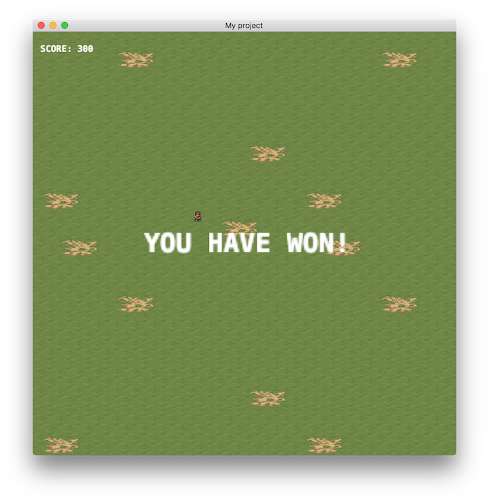

There you go! Well done!

## What next?

We hope you enjoyed this tutorial and that it was helpful. To get to know Defold better, we suggest that you to continue working with this little game. Here are a few suggested exercises:

1. Add directional animations for the player character. Tip, add a function called `update_animation(self)` to the `update()` function and change the animation depending on the value of the `self.dir` vector. It is also worth remembering that if you send a "play_animation" message each frame to a sprite, the animation will restart from the beginning, each frame---so you should only send "play_animation" when the animation should change.

2. Add an "idle" state to the player character so it only plays a walking animation when moving.

3. Make the tanks spawn dynamically. Look at how the rockets are spawned and do a similar setup for the tanks. You might want to create a new game object in the main collection with a script that controls the tank spawning.

4. Make the tanks patrol the map. One simple option is to have the tank pick a random point on the map and move towards that point. When it is within a short distance of the point, it picks a new point.

5. Make the tanks chase the player. One option is to add a new collision object to the tank with a spherical shape. If the player collides with the collision object, have the tank drive towards the player.

6. Make the tanks fire at the player.

7. Add sound effects.


Check out the [documentation pages](https://defold.com/learn) for examples, tutorials, manuals and API docs.

If you run into trouble, help is available in [our forum](https://forum.defold.com).

Happy Defolding!

---
